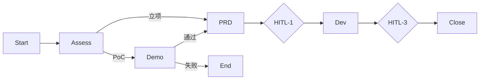

# Agent 编排模式对比 · OPC 选型说明

| 项 | 内容 |
|----|------|
| 版本 | v1.0 |
| 读者 | Founder — 用于判断「我们的编排是否合理」 |
| 详细设计 | [AGENTS.md](./AGENTS.md) |
| 文档位置 | `~/Documents/opc-agent-framework/docs/` |

> **主线仓库是 `~/Documents/opc-agent-framework`。**  
> 早期 `opc-agent-cluster` 文档已迁入 [`reference/from-cluster/`](../reference/from-cluster/)。

---

## 1. 五种常见编排模式（一句话）

| 模式 | 像什么 | 代表框架/产品 |
|------|--------|----------------|
| **A. 群聊** | 五个员工在一个微信群吵 | AutoGen GroupChat、部分 Multi-Agent Demo |
| **B. 流水线** | 工厂流水线，上道工序完下道接 | LangChain Chain、固定 DAG |
| **C. 图编排** | 流程图，有分支、循环、人工节点 | **LangGraph**、Temporal |
| **D. 层级经理** | 项目经理派活，员工汇报 | **CrewAI** hierarchical、OpenAI Swarm handoff |
| **E. 纯审批 UI** | 没有员工，只有表单和按钮 | 普通 CRM / 飞书审批 |

**OPC 选型：D 的变体（CEO 星型）+ C 的 HITL 节点 + 我们自己的 5 阶段业务表。**

不是 A（**自由**群聊），也不是 E（假 Agent）。

**补充（Founder 需求）：** 允许 **CEO 发起的有限会诊室** —— 有议程、有轮次上限、必产出 Decision Memo、Founder 旁观。这是 D 上的 **子状态**，不是改选 A。详见 [AGENTS.md §4.1](./AGENTS.md#41-例外通道ceo-会诊室clarification-room)。

---

## 2. 同一业务场景 · 五种模式长什么样

**场景：** Acme 审批流项目，开发已完成 staging，要走到 **HITL-3（你批交付物）**。

### A. 群聊模式

```
[群聊窗口]
开发 Agent：staging 好了，@产品 你看 scope 对吗？
产品 Agent：@法务 合同里写的是 5 节点不是 4 个
法务 Agent：@CEO 别问我，PRD 没写清楚
CEO Agent：@Founder 他们吵起来了你管管
你：？？？
```

| 效果 | 评价 |
|------|------|
| 像真人在聊天 | ✓ 戏剧性强 |
| 进度可追踪 | ✗ 消息淹没，难审计 |
| 成本 | ✗ Token 爆炸（多轮互 @） |
| 一人公司 | ✗ **最不像**你带团队的方式 |

---

### B. 流水线模式

```
获客 → PRD → 报价 → 开发 → 交付 → 结束
         ↑ 不能回头
```

Acme 走到开发交付时，发现要改 PRD：

| 效果 | 评价 |
|------|------|
| 简单可预测 | ✓ |
| PoC 分支 / 需求变更回流 | ✗ **不支持**，要硬改流程 |
| CEO 是否参与 | ✗ 常变成纯脚本，CEO 变装饰 |

**你们 architecture v3 已明确：要有 PoC 分支、阶段 5 续费——流水线太直。**

---

### C. 图编排（LangGraph 风格）



| 效果 | 评价 |
|------|------|
| 分支、循环、HITL | ✓ **最灵活** |
| 和看板 tasks/inbox 对齐 | ✓ 节点 = 状态 |
| 学习/维护成本 | △ 图一复杂就难改 |
| OPC 关系 | **Phase 3 备选引擎**；业务转移表可先简版实现 |

**业界参考：** LangGraph 的 [Supervisor 模式](https://langchain-ai.github.io/langgraph/) — 一个 supervisor 节点派活给 worker 节点，**和 OPC 的 CEO 很像**。

---

### D. 层级经理模式（CrewAI / Swarm handoff）

```
Founder
   │
CEO（Manager）─────── 唯一和你对话
   ├── Dispatch → 产品 Agent → 产出 PRD.md
   ├── Dispatch → 法务 Agent → 产出 SOW.md
   ├── Dispatch → 开发 Agent → 产出 Demo
   └── 汇总 → inbox「HITL-3 请批」→ 你
```

| 效果 | 评价 |
|------|------|
| 像一人公司带团队 | ✓ **最贴 OPC** |
| 不群聊，有交接物 | ✓ Handoff = 文件 |
| Founder 不找各部门 | ✓ 只找 CEO |
| 日常排期谁做 | △ 需约定：运营维护 Pipeline，CEO 管异常 |

**业界参考：**

| 产品 | 做法 | 和 OPC 相似度 |
|------|------|----------------|
| **CrewAI** | `manager_llm` + `agents` + `tasks` | 高 — 有 Task 链 |
| **OpenAI Swarm** | `handoff()` 函数切换 Agent | 高 — 强调 handoff 非 chat |
| **Microsoft Magentic-One** | Orchestrator +  specialist agents | 高 — 中央编排 |
| **Devin / Cursor Agent** | 单 Agent 多工具 | 低 — 你是多角色公司 |

**OPC 文档里的 Dispatch / Handoff / HITL，本质上就是 Swarm + CrewAI 的「任务驱动 handoff」，不是自由对话。**

---

### E. 纯审批 UI（Phase 2 若不做 Phase 3）

```
你看板 → 点「批准 HITL-3」→ 数据库字段变了 → 无 LLM
CEO FAB → 存一条文本 → 固定回复「已收到」
```

| 效果 | 评价 |
|------|------|
| 演示看板 | ✓ 够 Mock |
| 自动写 PRD / 写代码 | ✗ 没有 |
| 是 Agent 公司吗 | ✗ **不是** |

**这就是你担心的情况——Phase 2  alone 就是这个。**

---

## 3. 对照表（帮你快速判断）

| 维度 | 群聊 A | 流水线 B | 图 C | **CEO星型 D（OPC）** | 纯UI E |
|------|--------|----------|------|---------------------|--------|
| 像真公司 | 假 | 中 | 中 | **高** | 低 |
| 可审计 | 低 | 高 | 高 | **高** | 高 |
| Token 成本 | 高 | 低 | 中 | **可控** | 无 |
| PoC/回流 | 中 | 低 | **高** | **高** | 无 |
| HITL 卡点 | 难 | 中 | **高** | **高** | 仅 UI |
| 实现难度 | 低 | 低 | 高 | **中** | 最低 |
| 适合一人公司 | ✗ | △ | ✓ | **✓✓** | △ |

---

## 4. OPC 编排跑起来时 · 你感受到的效果

### 4.1 和「纯 Chat 项目」的区别

| 纯 Chat | OPC 编排 |
|---------|----------|
| 你问一句 CEO 答一句 | 你投递纪要 → **自动**出现 product/dev 的 task |
| 进度靠聊出来 | 进度看 **task + artifact 文件** |
| 交付物在消息里 | 交付物在 **项目文件夹** |
| 批准 = 继续聊 | 批准 HITL → **Orchestrator 自动派下游** |

### 4.2 和 CrewAI 跑一个项目的对比（效果级）

若用 CrewAI 写 Acme 项目，大致是：

```python
crew = Crew(
  manager=ceo_agent,
  agents=[product, legal, dev, ops],
  tasks=[assess_task, prd_task, dev_task, ...],
  process=Process.hierarchical
)
crew.kickoff()
```

**OPC Phase 3 等价物：**

- `Crew` → 我们的 **Orchestrator + workflow_templates**
- `Task` → 数据库 `tasks` + `Dispatch` 事件
- `manager` → **CEO Runner**（唯一对你）
- 产出 → `artifacts/*.md` + 看板工作室
- 你审批 → **HITL 节点**（CrewAI 没有内置，我们要自己做，看板 inbox 就是）

**差异：** OPC 多 **5 阶段商业闭环、项目盈亏、结项 ZIP、一页纸周报** —— 这是「公司 OS」，CrewAI 只是「一次 crew 运行」。

### 4.3 和 LangGraph Supervisor 的对比

LangGraph 官方 [Supervisor 教程](https://langchain-ai.github.io/langgraph/tutorials/multi_agent/agent_supervisor/) 结构：

```
supervisor (LLM 决定 next worker)
   → researcher / coder / ...
   → 回到 supervisor
   → 直到 FINISH
```

OPC 映射：

| LangGraph | OPC |
|-----------|-----|
| supervisor | CEO Orchestrator |
| worker | product / dev / legal / ops Runner |
| FINISH | 阶段推进 / HITL / Complete |
| human_in_the_loop | **HITL-1~4 + 看板 inbox** |

**我们 Phase 3a 可先不用 LangGraph，用「转移表 + 事件」实现同样拓扑；复杂后再换 LangGraph 引擎，API/看板不用改。**

---

## 5. 为什么不用「更简单」的方案？

| 你可能想 | 问题 |
|----------|------|
| 一个超级 Agent 全包 | 一人公司五角色分工消失，PRD/法务/开发边界模糊，**难审计报价** |
| 五个 Agent **自由**群聊 | Token 贵、进度乱，**不像你带团队** |
| CEO **有限会诊**（§4.1） | ✓ 可接受：仍由 CEO 主持、有收口；**不是**改选 A |
| 只做 Phase 2 无 LLM | **就是 E 模式**，你已指出 |
| 直接上 LangGraph 不重做看板 | 可以，但 **Phase 2 控制面**（项目文件、盈亏、HITL 历史）仍要先有 |

---

## 6. 推荐路径（降低判断成本）

不必先赌 LangGraph vs CrewAI。建议：

```
Phase 2  看板 + API + 项目文件     → 你能看到「公司台账」
Phase 3a 编排骨架（转移表）        → 手动触发 event，看 task 是否自动链
Phase 3b 只接 CEO Runner          → 投递纪要 → 自动 Dispatch（第一个「真 Agent」）
Phase 3c 接一个 dev Runner        → 自动写 PRD/demo 文件到工作室
         ↑ 到这里你就能判断效果
Phase 3d 再决定是否换 LangGraph 引擎
```

**3b 完成后你就能对比：** 同一句话给 CEO，是「固定 ack」还是「自动建 Beta 评估 task + 更新 Pipeline」。

---

## 7. 文档在哪（请用 Finder / Cursor 打开此目录）

```
/Users/simon/Documents/opc-agent-framework/docs/
├── PRD.md                 产品需求
├── BACKEND.md             技术栈
├── API.md                 接口契约
├── AGENTS.md              Agent 编排设计（详细）
├── AGENTS-COMPARE.md      本文 · 模式对比
├── IMPLEMENTATION.md      Phase 2/3 实施计划
└── schemas/
    └── dashboard.v1.schema.json
```

**在 Cursor：** File → Open Folder → 选 `~/Documents/opc-agent-framework`  
**或终端：** `open ~/Documents/opc-agent-framework/docs`

GitHub 仓库 `simmon-clap/opc-studio` 若尚未 push，网上也看不到——需本地 push 后才能在 GitHub 浏览。

---

## 8. 请你用「效果」来拍板（三个选择题）

不用先懂技术，选你更想要的行为：

**Q1. 你投递 Acme 需求纪要后，希望系统：**  
- A) CEO 回一句「已收到」  
- B) CEO 自动登记 Pipeline + 派产品写 PRD + 看板出现 running task  

→ 选 B = 需要 Phase 3 编排 + Runner

**Q2. 开发完成 staging 后，希望：**  
- A) 开发 Agent 在聊天里 @你  
- B) CEO 打包 HITL-3 进 inbox，你在看板批，批完自动进入结项清单  

→ 选 B = CEO 星型 + HITL（我们的设计）

**Q3. 多项目并行（Acme + Beta）时，希望：**  
- A) 一个聊天窗口混聊  
- B) 看板分项目、分 task、分盈亏  

→ 选 B = 控制面（Phase 2）+ 编排（Phase 3），不是群聊

若三题都选 B，**当前 AGENTS.md 的编排方向与业界 Supervisor/Handoff 模式一致，是合理选型。**

---

## 9. 延伸阅读（自行查阅）

| 资料 | 看什么 |
|------|--------|
| [LangGraph Multi-Agent Supervisor](https://langchain-ai.github.io/langgraph/tutorials/multi_agent/agent_supervisor/) | 中央调度 + worker，最接近 CEO 模型 |
| [OpenAI Swarm — Handoffs](https://github.com/openai/swarm) | handoff 原语，非群聊 |
| [CrewAI Hierarchical Process](https://docs.crewai.com/core-concepts/Processes/) | manager 派 task |
| 本项目 `architecture.html` | 5 阶段 + HITL + PoC 分支（业务编排的「需求来源」） |
