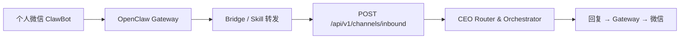
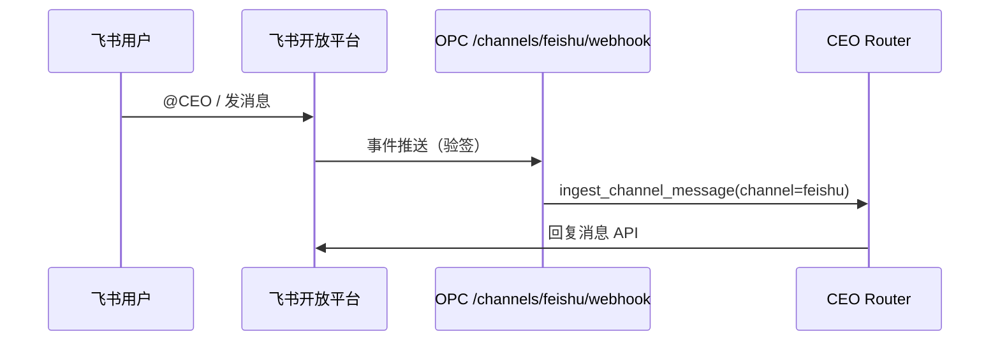

# 渠道接入设计 · 微信 ClawBot & 飞书

> OPC Studio 与外部 IM 的统一入口：`Channel Adapter → CEO Router → Orchestrator`  
> **状态：** Now ✅ · Phase 2d/2x/3 ❌ · [DEV-STATUS §3.1](./DEV-STATUS.md#31-p0--渠道)

## 1. 目标

- **微信**：优先走官方 **ClawBot** 插件（个人微信扫码，无封号风险）
- **飞书**：企业自建应用 + 事件订阅 Webhook（Phase 2d）
- **Web**：现有 CEO 办公室（已上线）

所有渠道消息最终写入 `ceoThread`，走同一套 CEO 编排逻辑。

---

## 2. 微信 · ClawBot（推荐路径）

### 2.1 是什么

微信官方 **ClawBot** 插件（2026 灰度）允许将 **OpenClaw Gateway** 作为 AI 联系人接入个人微信：

- 入口：微信 → 我 → 设置 → **插件 → ClawBot**
- 要求：iOS 微信 **8.0.70+** / Android **8.0.69+**（灰度中，非全量）
- 安装 CLI：

```bash
npx -y @tencent-weixin/openclaw-weixin-cli@latest install
```

扫码后，微信内可直接与 OpenClaw Agent 对话。

参考：[OpenClaw 微信接入指南](https://openclawgithub.cc/guide/channels/wechat/) · 公众号文章（ClawBot 介绍）

### 2.2 OPC Studio 与 ClawBot 的关系

ClawBot **原生绑定 OpenClaw Gateway**，不是直接连 OPC API。因此 OPC 采用 **Bridge 模式**：



**Bridge 实现选项（按推荐顺序）：**

| 方案 | 说明 | 适合 |
|------|------|------|
| **A. OpenClaw Custom Skill** | 在 Gateway 侧写 Skill，收到消息后 `POST` 到 OPC `channels/inbound` | 已有 OpenClaw 本地/云端实例 |
| **B. OpenClaw Hook** | Gateway `hooks` 配置 outbound webhook 到 OPC | 轻量转发 |
| **C. 腾讯云 Lighthouse 一体** | Lighthouse OpenClaw 控制台「微信通道」扫码 + 配置 Bridge URL | 免自建 Gateway |

OPC 已提供统一入口：

```http
POST /api/v1/channels/inbound
Content-Type: application/json

{
  "channel": "wechat",
  "text": "华为 NDA 进展如何？",
  "senderName": "Founder"
}
```

响应后后台触发 CEO chat workflow，与 Web 发 brief 行为一致。

### 2.3 用户操作清单（ClawBot → OPC）

1. 本机或云端运行 **OpenClaw Gateway**（ClawBot CLI 会检测/启动）
2. 微信升级 + 打开 ClawBot 插件 → 扫码绑定
3. 配置 Bridge 将消息转发到 `http://<你的域名>/api/v1/channels/inbound`
4. OPC 设置页 → **系统设置 → 渠道** 查看 Bridge URL 与 CLI 命令
5. 公网访问：本地开发用 [Cloudflare Tunnel](../deploy/cloudflare/tunnel.yml.example) 或 ngrok

### 2.4 备选方案

| 方案 | 稳定性 | 说明 |
|------|--------|------|
| **企业微信自建应用** | 高 | 官方 API；个人微信可通过企微「微信插件」关联 |
| **openclaw-wechat 插件** | 中高 | 社区企微渠道，支持个人微信桥接 |
| **Wechaty 个人号** | 低（封号风险） | 不推荐生产 |

---

## 3. 飞书（Phase 2d）

### 3.1 架构



### 3.2 待实现

- [ ] `POST /api/v1/channels/feishu/webhook` 验签 + 事件解析
- [ ] `systemSettings.channels.feishu` 存 App ID / Secret
- [ ] 出站：`channels/feishu/send` 回复 thread
- [ ] 设置页表单保存凭证

Webhook URL（已预留）：

```
https://<公网域名>/api/v1/channels/feishu/webhook
```

---

## 4. API 一览

| 方法 | 路径 | 状态 |
|------|------|------|
| GET | `/api/v1/channels/status` | ✅ 连接状态 |
| GET | `/api/v1/channels/setup` | ✅ 接入指引（含 ClawBot CLI） |
| POST | `/api/v1/channels/inbound` | ✅ 统一消息入口 |
| POST | `/api/v1/channels/feishu/webhook` | ❌ **501 占位**（Phase 2d） |

---

## 5. 数据模型

`ceoThread[]` 消息字段：

```json
{
  "direction": "founder_to_ceo",
  "channel": "wechat",
  "text": "...",
  "senderId": "optional",
  "senderName": "Founder",
  "at": "ISO8601"
}
```

`systemSettings.channels`（持久化凭证，Epic C）：

```json
{
  "feishu": { "appId": "", "appSecret": "" },
  "wechat": { "bridgeMode": "clawbot", "gatewayUrl": "" }
}
```

---

## 6. 实施路线图

| 阶段 | 内容 | 预估 |
|------|------|------|
| **Now** | inbound API + 设置页 ClawBot 指引 + 设计文档 | ✅ |
| **Phase 2d** | 飞书 Webhook 全链路 | 3–5 天 |
| **Phase 2x** | OpenClaw Bridge Skill 模板（仓库内 `bridge/openclaw-opc/`） | 2 天 |
| **Phase 3** | 渠道凭证 UI + 出站回复同步 | 3 天 |

---

## 7. 本地开发

```bash
# 启动 OPC
./start.sh

# 公网隧道（飞书 / Bridge 必需）
cloudflared tunnel --url http://127.0.0.1:8765

# 测试 inbound
curl -X POST http://127.0.0.1:8765/api/v1/channels/inbound \
  -H 'Content-Type: application/json' \
  -d '{"channel":"wechat","text":"测试 CEO 通道"}'
```

设置页：**系统设置 → 渠道** 可复制 ClawBot CLI 与 Bridge URL。
