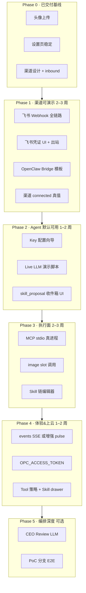

# OPC Studio · 功能完善路线图

> **SSOT：** [DEV-STATUS.md](./DEV-STATUS.md)  
> **版本基线：** `0.9.x` · **160 tests passed** · **文档同步：2026-05-24**  
> **目的：** 对照 PRD / IMPLEMENTATION / 各 v2 规范 / 设置&渠道路线图，列出「已交付 / 半完成 / 未做」，并给出统一实施顺序。  
> **关联文档：** [PRD](PRD.md) · [IMPLEMENTATION](IMPLEMENTATION.md) · [SETTINGS-PLATFORM-ROADMAP](SETTINGS-PLATFORM-ROADMAP.md) · [CEO-ORCHESTRATION-ROADMAP](CEO-ORCHESTRATION-ROADMAP.md) · [CHANNELS-INTEGRATION](CHANNELS-INTEGRATION.md)

---

## 1. Executive Summary

**已经很强：** 控制面 API、7 Tab 看板、工作室/经营/周报 v2、CEO Turn + commitments + 文件 Ingress、Pulse/Agency 运行时、设置平台 Epic 1–5 **后端主体**、160 项自动化测试。

**用户仍会感到「没做完」的主因：**

| 感知 | 根因 |
|------|------|
| 接不进微信/飞书 | 渠道只有 inbound 骨架 + 文档；飞书 Webhook **501**；ClawBot 需 OpenClaw Bridge |
| Agent 像 Mock | 无 Key 时 Stub Runner；有 Key 才可走 LLM，缺「首次配置向导」 |
| 设置页仍缺块 | Tool 策略 UI、Skill 详情、链编辑器、渠道凭证表单 |
| 多模态/MCP 虚 | MCP bridge 全 stub；image/video 槽仅配置、无真实调用 |
| 收件箱类型不全 | `skill_proposal` 有 API、无专用 Modal |
| 文档与代码不同步 | PRD/IMPLEMENTATION 验收框未勾；README 仍写「LLM 未做」 | **已同步 2026-05-24** → [DEV-STATUS.md](./DEV-STATUS.md) |

**建议主攻顺序：** **渠道可演示 → Agent 默认可用 → 执行面补全 → 体验&上云 → 编排深度（可选）**。

---

## 2. 已实现清单（可视为 Done）

### 2.1 控制面 & 看板（Phase 2）

| 能力 | 证据 |
|------|------|
| Dashboard 聚合 | `GET /api/v1/dashboard` |
| 项目 / 客户 / 产出物 / ZIP | `projects.py` · `artifacts.py` |
| 收件箱 / HITL 批驳 | `inbox.py` · `hitl.py` |
| CEO Brief + 线程 + 附件 Ingress | `ceo.py` · `ingress_documents.py` |
| 周报 v2 / 经营 v2 | `weekly.py` · `finance.py` + 前端模块 |
| 角色配置 + 分槽 API Key | `roles.py` · `role_credentials.py` |
| 一键启动 / 部署骨架 | `start.sh` · `deploy/` |

### 2.2 工作室（WORKROOM-V2）

| 能力 | 证据 |
|------|------|
| Workroom 聚合 API | `GET /projects/{id}/workroom` |
| 焦点条 / 阶段 / Viewer / diff | `workroom.js` |
| 会诊折叠展示 | deliberation API + workroom |

### 2.3 CEO 编排（CEO-ORCHESTRATION Phase 0–5）

| 能力 | 证据 |
|------|------|
| CEO Turn 结构化 | `ceo_turn.py` |
| Commitments + projectBriefs | `commitments.py` · `project_briefs.py` |
| CEO Review（规则分）+ revision | `ceo_review.py` |
| Founder Profile + 偏好建议 | `founder.py` + inbox |
| Workflow engine + next-steps | `workflow_engine.py` |
| 华为 NDA 场景测试 | `tests/scenarios/test_huawei_nda.py` |

### 2.4 Pulse & Agency（PULSE-AGENCY-SPEC）

| 能力 | 证据 |
|------|------|
| L1 tick + execution/reconcile/handoff | `pulse/modules/*` |
| Agency observe + CEO 自动派活 | `agency/` |
| SSE `/pulse/stream` | 前端 EventSource + 15s 轮询兜底 |

### 2.5 设置平台 Epic 1–5（后端 + 主体 UI）

| Epic | 状态 | 说明 |
|------|------|------|
| 1 角色平台 | ✅ | registry CRUD、身份/Profile、**头像上传**、分槽 Model |
| 2 Tool Registry | ✅ | 注册表 + `GET /tools/effective/{roleId}` + enforce |
| 3 Skill Hub | ⚠️ 后端 ✅ | catalog/import/activate；CEO tool + inbox API |
| 4 MCP Bridge | ⚠️ stub | CRUD + health **假数据** |
| 5 Skill 链 | ⚠️ API ✅ | executor 有；**无设置页编辑器** |

**近期补齐（v0.9.18–0.9.20）：**

- 设置页 Pulse 重绘导致编辑闪退 → 已修
- 分能力 Model URL/Key（去 MCP 混用）→ 已修
- `POST /roles/{id}/avatar` → 已做
- `GET /channels/setup` · `POST /channels/inbound` → 已做
- [CHANNELS-INTEGRATION.md](CHANNELS-INTEGRATION.md) ClawBot 设计 → 已写

---

## 3. 缺口矩阵（文档有 · 代码无或未闭环）

### 3.1 渠道 · 微信 & 飞书（P0）

| # | 项 | 文档 | 现状 |
|---|-----|------|------|
| C1 | 飞书 Webhook 验签 + 事件解析 | CHANNELS §3 · IMPLEMENTATION 2d | `channels/feishu/webhook` → **501** |
| C2 | 飞书出站回复（CEO → 飞书） | CHANNELS §6 Phase 3 | 无 `channels/feishu/send` |
| C3 | 飞书凭证设置页 | SETTINGS-V2 §渠道 · CHANNELS §3.2 | 只读指引，无 App ID/Secret 表单 |
| C4 | OpenClaw Bridge 模板 | CHANNELS §6 Phase 2x | 仓库无 `bridge/` 目录 |
| C5 | 微信 ClawBot 一键桥接 | 公众号 ClawBot 文章 | 需 Gateway + Bridge POST inbound |
| C6 | 渠道连接状态真值 | dashboard `channels.*.connected` | 仍为 seed mock，非探测 |

### 3.2 Agent 真实运行（P0）

| # | 项 | 文档 | 现状 |
|---|-----|------|------|
| A1 | 配置 Key 后端到端演示 | IMPLEMENTATION §5 · PRD Phase 2 | 可行但未文档化；CI 全 Stub |
| A2 | 首次启动 / 设置向导 | SETTINGS-V2 | 无 |
| A3 | README 与实现一致 | README §已实现 | 仍写「LLM 未做」（实际 `llm_client` 已有） |
| A4 | CEO Review LLM 层 | CEO-ROADMAP Phase 2 | 仅规则 validator |

### 3.3 设置 & 收件箱 polish（P1）

| # | 项 | 文档 | 现状 |
|---|-----|------|------|
| S1 | Tool 策略 allow/deny UI | SETTINGS-ROADMAP Epic 2.5 | 后端 `toolPolicy` 有，UI 无 |
| S2 | Skill 详情 drawer | SETTINGS-IMPLEMENTATION §后续 | 列表仅前 20 条 |
| S3 | Skill 链可视化编辑 | Epic 5.3 | 仅 API |
| S4 | `skill_proposal` 收件箱 Modal | SKILL-HUB · Epic 3.6 | API + `skill-install` 有；**前端无 category 分支** |
| S5 | Brief 附件 → 自动 skill 提案 | Epic 3.6 | 未接附件管线 |
| S6 | `meta.skillRoutes` 可视化 | SETTINGS-ROADMAP | 后端有，UI 无 |

### 3.4 执行面 · MCP & 多模态（P1）

| # | 项 | 文档 | 现状 |
|---|-----|------|------|
| E1 | MCP stdio 真子进程 | Epic 4.2 · `mcp/bridge.py` | **全 stub** |
| E2 | image/video slot 真实调用 | Epic 4.3 | 仅 text `chat_completion` |
| E3 | 经营页按 capability 分账 | FINANCE-V2 延伸 | 未做 |

### 3.5 实时 & 上云（P2）

| # | 项 | 文档 | 现状 |
|---|-----|------|------|
| R1 | 统一 `GET /api/v1/events` SSE | API.md §7 · IMPLEMENTATION 4b | 仅 pulse/orchestration 两路 |
| R2 | 前端 sig 增量刷新（降全量 dashboard） | PULSE-AGENCY §12 | 15s 仍全量 pull |
| R3 | `OPC_ACCESS_TOKEN` 鉴权 | deploy/README | `.env.example` 有，**代码未校验** |
| R4 | Cloudflare Tunnel 与渠道联调文档 | deploy/ | 有示例，无端到端 checklist |

### 3.6 编排深度（P3 · 可选）

| # | 项 | 文档 | 现状 |
|---|-----|------|------|
| O1 | PoC 分支 + Beta 并行验收 | IMPLEMENTATION 3e | 部分转移，无 E2E |
| O2 | 会诊 Founder 插话 UI | AGENTS §4.1.5 | API 有，专用 UI 无 |
| O3 | Escalate 2 轮后 Founder 完整链 | CEO-ROADMAP | 规则有，演示弱 |

### 3.7 明确不做（文档已否决）

- 登录 / 多租户 / Agent 自由群聊
- 个人微信非官方桥接（Wechaty 等）
- Docker 单容器（PRD 后置）
- 向量 RAG 长记忆、`.docx` 解析

---

## 4. 统一实施路线图

---

## 5. 分 Phase 详细任务

### Phase 0 ✅ 近期已完成（v0.9.18–0.9.20）

- [x] 设置页防 Pulse 重绘闪退
- [x] 角色分槽 Model（URL/Key 独立）
- [x] 头像上传 API + 设置 UI + 全站 `avatarSrc`
- [x] 渠道 inbound / setup API + 设置页 ClawBot 指引
- [x] [CHANNELS-INTEGRATION.md](CHANNELS-INTEGRATION.md)

---

### Phase 1 · 渠道可演示（**L · 2–3 周**）

**目标：** Founder 能在飞书或微信（经 ClawBot Bridge）与 CEO 对话，消息进 `ceoThread` 并收到回复。

| 任务 | 交付 | 验收 |
|------|------|------|
| **1.1 飞书 Webhook** | `backend/app/channels/feishu.py`：验签、解析 `im.message.receive_v1` | 飞书发 @CEO → inbox/thread 可见 |
| **1.2 飞书出站** | `POST /channels/feishu/send` 或内部 reply helper | CEO 回复推回飞书会话 |
| **1.3 凭证 UI** | 设置 → 渠道：App ID、Secret、Encrypt Key、Verification Token | PATCH `systemSettings.channels.feishu` 持久化 |
| **1.4 Bridge 模板** | `bridge/openclaw-opc/README.md` + 示例 Skill/hook | ClawBot 用户复制 Bridge URL 即可连 OPC |
| **1.5 连接探测** | `GET /channels/status` 读真实配置 + 可选 ping | 设置页 pill 显示「已配置 / 未配置」 |
| **1.6 隧道 checklist** | 扩展 `deploy/README.md`：Tunnel + 飞书回调 URL | 本地 dev 可 30 分钟内打通 |

**微信 ClawBot 路径（本 Phase 不重复造轮子）：**

1. 用户本机/云端 OpenClaw Gateway  
2. `npx -y @tencent-weixin/openclaw-weixin-cli@latest install` 扫码  
3. Bridge 转发 → `POST /api/v1/channels/inbound`（**已实现**）

---

### Phase 2 · Agent 默认可用（**M · 1–2 周**）

**目标：** 新用户配置 Key 后，一条命令跑通「Brief → 派活 → 产出 → HITL」。

| 任务 | 交付 | 验收 |
|------|------|------|
| **2.1 配置向导** | 设置页或首次访问 banner：CEO Key + 测试连接 | 无 Key 时明确引导，非静默 Stub |
| **2.2 Live 演示** | `scripts/demo-live-llm.sh` 或 pytest marker `@live_llm` | Huawei NDA 场景 optional live run |
| **2.3 skill_proposal UI** | `app.js` inbox Modal + 采纳调 `skill-install` | 与 `profile_suggestion` 同级体验 |
| **2.4 附件 → Skill** | CEO brief 附件检测 SKILL frontmatter → inbox | Epic 3.6 闭环 |
| **2.5 文档同步** | 更新 README、PRD 验收框、IMPLEMENTATION 2a 勾选 | 文档 ≠ 代码 矛盾消除 |

---

### Phase 3 · 执行面补全（**L · 2–3 周**）

| 任务 | 交付 | 验收 |
|------|------|------|
| **3.1 MCP stdio** | `mcp/bridge.py` spawn + JSON-RPC | 设置页 health 显示真实进程 |
| **3.2 image slot** | `media_client.py` + runner 按 capability 路由 | 角色配 image 模型后可出图 artifact |
| **3.3 Skill 链 UI** | 设置页链编辑器 + dispatch 选 `skillChainId` | POST chain → CEO 派活走链 |
| **3.4 Tool 策略 UI** | 角色详情 allow/deny chips | 保存后 runner tool 列表变化 |

---

### Phase 4 · 体验 & 上云（**M · 1–2 周**）

| 任务 | 交付 | 验收 |
|------|------|------|
| **4.1 SSE 统一** | `GET /events` 或扩展 pulse payload（task/inbox/handoff） | 前端可减 `refreshDashboard` 频率 |
| **4.2 鉴权** | FastAPI 中间件校验 `OPC_ACCESS_TOKEN` | 公网 Tunnel 必配 Token |
| **4.3 Skill drawer** | 设置 Hub 点 Skill 看 MD/版本/绑定角色 | SETTINGS-V2 §2.2 |
| **4.4 设置/收件箱 polish** | 搜索 Skill、Orchestration 高级项折叠记忆 | 无回归闪退 |

---

### Phase 5 · 编排深度（**M · 可选**）

- CEO Review 叠加 LLM 评审（规则 + LLM）
- PoC 分支 + Acme/Beta 并行 E2E
- 会诊室 Founder 插话专用 UI
- video slot / 经营 capability 分账

---

## 6. 工作量粗估

| Phase | 范围 | 人力（专注） | 用户价值 |
|-------|------|--------------|----------|
| 0 | 头像/设置/渠道设计 | ✅ Done | 设置可用 |
| 1 | 飞书 + Bridge | 2–3 周 | **手机接 CEO** |
| 2 | LLM 演示 + Skill inbox | 1–2 周 | **真 Agent 感** |
| 3 | MCP/多模态/链 UI | 2–3 周 | 平台完整 |
| 4 | SSE/鉴权/polish | 1–2 周 | 上云安心 |
| 5 | 编排深度 | 1–2 周 | 差异化 |

**合计（Phase 1–4）：约 6–10 周** 达到「文档承诺的 Phase 2/4 渠道 + 设置平台全闭环」。

---

## 7. 建议的「下一 Sprint」（若只做 1 周）

1. **飞书 Webhook MVP**（验签 + 文本入站 → inbound）  
2. **飞书凭证 4 字段表单**（设置页）  
3. **skill_proposal 收件箱 Modal**  
4. **`bridge/openclaw-opc/` 最小 README + curl 示例**  
5. **README 修正**（LLM 已支持、Phase 2d 进行中）

---

## 8. 文档维护动作

| 文件 | 动作 |
|------|------|
| [README.md](../README.md) | Phase 表更新；LLM「配置 Key 可用」 |
| [PRD.md](PRD.md) | Phase 2 验收勾选已与 v0.9 对齐 |
| [IMPLEMENTATION.md](IMPLEMENTATION.md) | 2a–2c 验收 `[x]`；2d 指向本路线图 Phase 1 |
| [SETTINGS-IMPLEMENTATION.md](SETTINGS-IMPLEMENTATION.md) | Epic 4–5 stub 项标 ⚠️ |
| [API.md](API.md) | 补充 `/channels/*` · `/roles/*/avatar`；`/events` 标 planned |

---

## 9. 快速对照：你关心的几项

| 你的诉求 | 状态 | 下一步 |
|----------|------|--------|
| 头像可改 | ✅ v0.9.20 | — |
| 设置页编辑稳定 | ✅ | 持续监控 Pulse 交互 |
| 微信 ClawBot 接入 | 📋 设计 + inbound | **Phase 1.4 Bridge 模板** |
| 飞书接入 | ❌ Webhook 501 | **Phase 1.1–1.3** |
| Skill 可选/可装 | ⚠️ 保存 OK；proposal UI 缺 | **Phase 2.3** |
| Model 分槽配置 | ✅ | image 真调用 → Phase 3.2 |
| 新增角色 | ✅ | — |
| 后端设置持久化 | ✅ | 渠道凭证 UI → Phase 1.3 |

---

*维护：每完成一个 Phase 更新 §2 已实现与 §8 文档索引。Last updated: 2026-05-24.*
