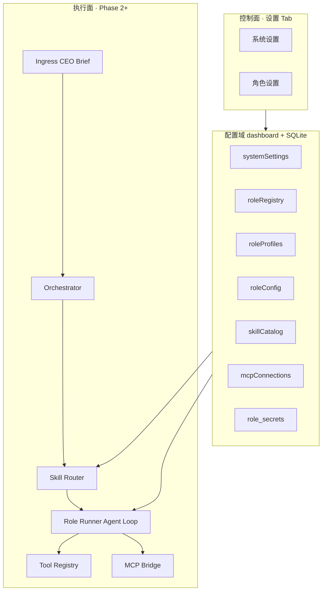
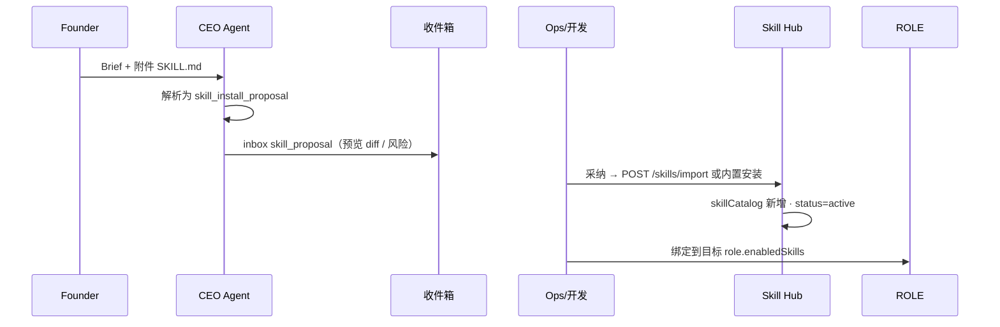

# 设置页 & 执行平台 · 迭代总规划

| 项 | 内容 |
|----|------|
| 版本 | v1.0 规划 |
| 状态 | **Epic 1–2 ✅ · Epic 3–5 ⚠️** · [DEV-STATUS.md §3.3–3.4](./DEV-STATUS.md) |
| 关联 | [SETTINGS-V2.md](./SETTINGS-V2.md) · [SKILL-HUB.md](./SKILL-HUB.md) · [SETTINGS-IMPLEMENTATION.md](./SETTINGS-IMPLEMENTATION.md) |

> **定位：** OPC Studio 不仅是看板，而是 **Agent 运营平台**。设置页 = 控制面；Skill Hub + Tool/MCP + 多 Model = 执行面。  
> **原则：** 与周报/经营/工作室一致 — UI 克制、职责清晰、单一数据源、可扩展。

---

## 1. 目标与边界

### 1.1 要解决的问题

| 现状 | 目标 |
|------|------|
| 设置页四块堆叠（角色 API / Founder / 编排 / 渠道） | **系统设置 · 角色设置** 两级 IA |
| 五角色硬编码 10+ 处 | **roleRegistry** 动态注册；设置页 **手动新增 role** |
| 每 role 单 `model` | **多 Model 槽**（text / image / video / …） |
| `tools` 白名单只读、未执行 | **Tool Registry** + 运行时 enforce |
| 无 Skill 概念 | **Skill Hub** + 角色绑定 + **Skill 链**（v1 单 Skill，架构预留链） |
| 无 MCP | **MCP Bridge**（本机 stdio，按 run 挂载） |
| 外部 Skill 无法进系统 | **CEO 收件 → 开发/Ops 装 Skill** 闭环（项目自身是 Agent） |

### 1.2 不在本规划内（明确排除）

- 渠道飞书/微信 **可写配置**（Phase C 以后）
- Cursor IDE MCP 与 Studio 服务端 MCP **双向同步**
- 全自动从互联网抓取 Skill（必须经 CEO/Founder 或 Ops 确认安装）

### 1.3 与现有 Tab 分工

| Tab | 职责 | 设置/平台禁止 duplicate |
|-----|------|-------------------------|
| **设置** | 系统偏好、角色能力、Skill/MCP 目录 | — |
| 概览 | 角色协作态势 | ❌ 改 API Key |
| 工作室 | 单项目交付 | ❌ 全局 Skill 管理 |
| 经营 | 成本 | ❌ 角色 Prompt 编辑 |
| 收件箱 | HITL / CEO 请示 | Skill **安装请求** 可进 inbox |

---

## 2. 概念模型（统一语言）

```
Capability  能力类型     text | image | video | code
Model Slot  模型槽       某 Capability 绑定的 model + provider + key
Tool        内置原子工具  update_pipeline, write_artifact, …
MCP         外部连接器   stdio/http MCP Server 实例
Skill       技能包       目标 + 步骤 + 所需 Tool/MCP + Prompt 模板
SkillChain  技能链       有序 Skill 列表（v1 单 Skill，schema 预留）
Role        角色         身份 + Profile + enabledSkills + modelSlots
Task        任务         roleId + taskKind + skillId? + skillChainId?
```

**有效权限（一次 Run）：**

```
allowedTools = ⋂(skill.tools) ∩ role.toolPolicy ∩ toolRegistry
allowedMcp   = ⋂(skill.mcp)   ∩ mcpConnections.allowedRoles(roleId)
models       = pick skill.requiredCapabilities → role.models[slot]
```

---

## 3. 架构总览



**同步：** `GET /dashboard` → `sync_settings()` + `sync_role_registry()` + `sync_skill_catalog()` 持久化衍生字段。

---

## 4. 设置页 IA（详见 SETTINGS-V2.md）

```
设置 Tab
├── [系统设置 | 角色设置]     ← 顶栏 segment（同经营 fin-segment）
│
├── 系统设置
│   ├── Founder Profile
│   ├── 编排与自动化（原 runtimeSettings）
│   ├── Skill Hub（目录 · 导入 · 启用）
│   └── MCP 连接（全局 · 健康 · 允许角色）
│
└── 角色设置
    ├── [+ 新增角色]          ← 不预置 brand mock；用户手动创建
    ├── 角色列表
    └── 角色详情
        ├── 身份（姓名/职位/部门/头像/Charter）
        ├── Profile（Markdown · 跟随 role）
        ├── 模型槽（多 Capability）
        └── 技能（从 Hub 勾选 · 可选 Skill 链模板）
```

---

## 5. 执行平台（详见 SKILL-HUB.md）

### 5.1 运行时链路

1. **Ingress** — Founder → CEO Brief（可附 Skill 文件/链接）
2. **Orchestrator** — 派 `Task { roleId, taskKind, skillId?, skillChainId? }`
3. **Skill Router** — 规则表 + 可选 CEO 指定；链模式按序执行
4. **RunContext** — 合并 role + skill + models + tools + mcp
5. **Agent Loop** — LLM ↔ Tool Registry ↔ MCP Bridge（maxSteps、记账）
6. **Trace** — `agent_runs` 记录 skill / tool / mcp / model 维度

### 5.2 CEO 驱动的 Skill 安装（项目自身是 Agent）



**Inbox 新类别：** `skill_proposal` — 含 `proposedSkill` JSON、`sourceDocument`、`riskNotes`  
**CEO 不做自动安装** — 仅提案；Ops/Founder 在设置页或 API 确认（HITL 可选）。

### 5.3 Skill 链

- **v1：** 单 Task 单 `skillId`；`skillChainId` 字段预留为 null
- **v1.5：** `skillChains[]` 定义有序 steps；Router 逐步执行，上一步 output → 下一步 input
- **约束：** 链内每步独立 `agent_run`；失败可 HITL 或跳过（策略在 chain 元数据）

---

## 6. 数据域概要

| Domain | 存储 | 说明 |
|--------|------|------|
| `roleRegistry` | dashboard | 角色定义：capabilities、dispatchable、overview 布局 |
| `roles[]` | dashboard | Live 身份 + 运行态 focus/load |
| `roleProfiles` | dashboard | 每 Agent Markdown Profile |
| `roleConfig[]` | dashboard + secrets | models、enabledSkills、tools 策略 |
| `skillCatalog[]` | dashboard | Hub 目录 |
| `skillChains[]` | dashboard | 链定义（v1.5） |
| `mcpConnections[]` | dashboard + secrets | MCP 实例 |
| `systemSettings` | dashboard | founderProfile + orchestration + channels |
| `meta.skillRoutes` | dashboard | taskKind → skillId 规则表 |

完整 JSON Schema 见 SETTINGS-V2.md、SKILL-HUB.md。

---

## 7. API 概要

| 分组 | 代表端点 |
|------|----------|
| 系统 | `GET/PATCH /system/settings` · `GET/PUT /founder/profile` |
| 编排 | `GET/PATCH /runtime/settings`（别名并入 system） |
| 角色 | `GET/POST /roles/registry` · `PATCH /roles/{id}/identity` · `GET/PUT /roles/{id}/profile` · `GET/PUT /roles/config/{id}` |
| Skill | `GET/POST /skills` · `POST /skills/import` · `POST /skills/{id}/activate` |
| Skill 链 | `GET/POST /skill-chains`（v1.5） |
| MCP | `GET/POST /mcp/connections` · `POST /mcp/connections/{id}/health` |
| 运行追踪 | `GET /agent-runs/{id}/trace` |
| CEO | `POST /ceo/brief` → 可产出 `skill_proposal` |

---

## 8. 迭代分期（Epic）

### Epic 0 · 文档与契约

- [x] SETTINGS-PLATFORM-ROADMAP.md（本文）
- [x] SETTINGS-V2.md
- [x] SKILL-HUB.md
- [x] CEO-ORCHESTRATION-ROADMAP Phase 6 索引
- [x] DEV-STATUS.md · API.md 渠道/设置索引（2026-05-24）
- [ ] 更新 PRD §设置、AGENTS §工具层（细项交叉引用）

**验收：** 团队对 IA / 数据域 / Epic 依赖无歧义。

---

### Epic 1 · 设置页 IA + 角色平台（约 2 周）

**目标：** 页面不再乱；可 **手动新增 role**；多 Model **配置**（text 先生效）。

| # | 交付 | 说明 |
|---|------|------|
| 1.1 | `settings.js` 拆分 | segment：系统 / 角色；Pulse 防闪退 |
| 1.2 | 系统设置页 | Founder + 编排合并；渠道只读 |
| 1.3 | `roleRegistry` + sync | 替代 DEFAULT_ROLES 只读来源 |
| 1.4 | **新增角色 UI + API** | `POST /roles/registry`；**不 seed brand** |
| 1.5 | 身份编辑 | 姓名、职位、部门、头像上传、Charter |
| 1.6 | `roleProfiles` + 编辑器 | 每 role Markdown Profile |
| 1.7 | 多 Model 槽 UI | `models.text` 写入；image/video 占位禁用态 |
| 1.8 | 测试 | registry CRUD、identity PATCH、dashboard sync |

**验收：**

- [x] 设置页仅两块主视图，无长 scroll 堆叠
- [x] 用户可新建任意 roleId（如 `brand`），出现在概览/派活候选（dispatchable 可配）
- [x] 保存 identity/profile/config 持久化且 Pulse 不闪退
- [x] 分槽 Model URL/Key 独立配置 · 头像上传

**依赖：** 无（仅 dashboard 域扩展）

---

### Epic 2 · Tool Registry + 权限执行（约 1.5 周）

**目标：** Skill 的「脚」能落地；`roleConfig.tools` 真正 enforce。

| # | 交付 | 说明 |
|---|------|------|
| 2.1 | `app/tools/registry.py` | 注册表 + JSON schema |
| 2.2 | 核心 Tools | pipeline、artifact、template、dispatch 等 |
| 2.3 | Runner Agent Loop v1 | text only；maxSteps；tool call 审计 |
| 2.4 | `agent_runs.tool_calls[]` | 可追溯 |
| 2.5 | 设置页 Tool 策略 | 角色详情：allow/deny chips（来自 registry） |

**验收：**

- [x] dev task 可 `write_artifact`；未授权 role 调用被拒
- [x] agent_run 可查 tool 调用链
- [ ] Tool 策略 allow/deny chips UI（后端 enforce ✅）

**依赖：** Epic 1（roleConfig 结构）

---

### Epic 3 · Skill Hub v1（约 2 周）

**目标：** 系统层 Skill 目录；角色绑定；规则路由；CEO 提案进 inbox。

| # | 交付 | 说明 |
|---|------|------|
| 3.1 | `skillCatalog` domain + sync | built-in 8~10 条 |
| 3.2 | Skill Hub UI | 系统设置：列表、详情 drawer、启用/停用 |
| 3.3 | `POST /skills/import` | SKILL.md 子集（frontmatter + body） |
| 3.4 | 角色 enabledSkills | 勾选 UI + 保存 |
| 3.5 | Skill Router（规则） | taskKind → skillId；单 Skill |
| 3.6 | CEO skill_proposal | Brief 附件 → inbox 项 → 采纳安装 |
| 3.7 | Run 详情 trace | 展示 skillId、model slot |

**验收：**

- [x] 导入一份外部 SKILL.md → catalog → 绑到自建 `brand` role
- [x] 派活带 taskKind 命中正确 skill（规则表）
- [ ] CEO 收到 Founder 发的 skill 文件 → inbox 提案 → 采纳后 Hub 可见（**skill_proposal Modal 缺**）
- [ ] Skill 详情 drawer · 搜索

**依赖：** Epic 2（skill 声明的 tools 可执行）

---

### Epic 4 · MCP Bridge + 多模态 Slot（约 2~3 周）

**目标：** image/video 等 Capability 真正可跑；MCP 按 run 挂载。

| # | 交付 | 说明 |
|---|------|------|
| 4.1 | `mcpConnections` + 设置 UI | stdio 命令、env 密钥、健康检查 |
| 4.2 | MCP Bridge | 子进程生命周期、超时、allowedRoles |
| 4.3 | `media_client` / 扩展 llm_client | image/video slot 调用 |
| 4.4 | Skill `mcp[]` 声明生效 | run 前挂载声明的 MCP |
| 4.5 | 经营成本 | 按 capability 记账（extension） |

**验收：**

- [ ] 自建 brand role + 绑含 `mcp: [image_gen]` 的 skill → run 产生图像 artifact（**MCP/image stub**）
- [ ] MCP 断开时 inbox 明确报错，不 silent fail
- [x] MCP 连接 CRUD + health stub API
- [x] image/video 槽可配置（无 Epic 4 锁定）

**依赖：** Epic 3

---

### Epic 5 · Skill 链 + 智能路由（约 2 周，可选）

| # | 交付 | 说明 |
|---|------|------|
| 5.1 | `skillChains[]` schema | steps[]: { skillId, onFail } |
| 5.2 | Chain Executor | 顺序 run；步骤间 artifact 传递 |
| 5.3 | 设置页链编辑器 | 简易有序列表 |
| 5.4 | CEO 可选链派活 | dispatch 输出 skillChainId |

**验收：**

- [x] 单 Task 触发 2~3 Skill 顺序执行，工作室可见中间产物（**后端 executor ✅**）
- [ ] 设置页 Skill 链编辑器 UI

**依赖：** Epic 4

---

## 9. 前端工程要点

| 项 | 方案 |
|----|------|
| 文件 | `dashboards/app/js/settings.js`（从 app.js 拆出） |
| 样式 | `app.css` → `.stg-*` 模块（对齐 `.fin-*` / `.wk-*`） |
| 新增角色 | Modal：id、显示名、capabilities[]、department、dispatchable |
| 头像 | 上传 → `assets/uploads/avatars/` 或 API 存 ref |
| 缓存 | `?v=` bump；`isSettingsUiInteractive()` |

---

## 10. 后端工程要点

| 项 | 方案 |
|----|------|
| Presentation | `presentation/settings.py` · `presentation/roles_registry.py` · `presentation/skills.py` |
| Normalize | `sync_settings()` 在 `GET /dashboard` persist |
| 硬编码清除 | `VALID_ROLES`、前端 `ROLE_SHORT` → 读 registry API |
| 密钥 | 仍 `role_secrets` + MCP secrets 分表 |
| Runner | `RunContext` dataclass 统一入口 |

---

## 11. 迁移策略（v1 → v2）

1. 启动时 `bootstrap_role_registry_from_defaults()` — 五角色写入 registry，**不新增 brand**
2. `roleConfig.model` → `roleConfig.models.text`
3. `roleConfig.tools` 保留至 Tool Registry 全量注册后改为 derived
4. `meta.runtimeSettings` → `systemSettings.orchestration`（双写一版后弃旧键）

---

## 12. 风险与缓解

| 风险 | 缓解 |
|------|------|
| 范围膨胀 | 严格按 Epic 验收；Epic 4 前不做 MCP |
| 新 role 无法派活 | registry.dispatchable + CEO 提示「role 未配 Key/skill」 |
| Skill 导入恶意内容 | import 仅 Ops；CEO 提案 + 可选 HITL；sandbox 读文件 |
| MCP 进程泄漏 | run 结束必 kill；全局并发上限 |
| 概览布局新 role | 默认 overview 坐标；Phase 1 可手动 JSON，Phase 2 拖拽 |

---

## 13. 建议实施顺序（一句话）

**Epic 1 设置+角色 → Epic 2 Tools → Epic 3 Skill Hub+CEO 安装 → Epic 4 MCP+多模态 → Epic 5 链**

**当前：** Epic 1–2 ✅ · Epic 3–5 后端主体 ⚠️ — 见 [SETTINGS-IMPLEMENTATION.md](./SETTINGS-IMPLEMENTATION.md) · 未完成 [DEV-STATUS §3.3–3.4](./DEV-STATUS.md#33-p1--设置--skill-ui)。
