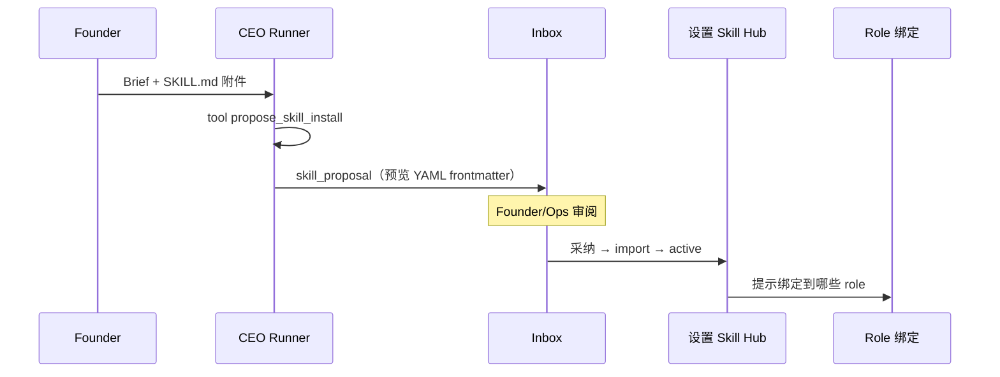

# Skill Hub & 执行平台规范

> Skill = 可安装、可绑定、可路由的 **工作流包**。Hub 在 **系统设置**；角色只 **勾选**；运行在 **Orchestrator → Router → Runner → Tool/MCP**。

| 状态 | **后端 ✅ · UI 部分缺** · [DEV-STATUS §3.3](./DEV-STATUS.md#33-p1--设置--skill-ui) |
|------|------|

## 1. 与 Tool / MCP / Model 的关系

```
┌──────────── Skill Hub（系统目录）─────────────────────────┐
│  skillCatalog[]  ·  skillChains[]（v1.5）  ·  导入/版本   │
└───────────────────────────┬───────────────────────────────┘
                            │ enabledSkills[]
┌───────────────────────────▼───────────────────────────────┐
│  Role（角色设置）                                          │
│  models.{text,image,video}  ·  toolPolicy  ·  profile     │
└───────────────────────────┬───────────────────────────────┘
                            │ RunContext
┌───────────────────────────▼───────────────────────────────┐
│  Runner Agent Loop                                         │
│  LLM(model slot) ↔ Tool Registry ↔ MCP Bridge              │
└───────────────────────────────────────────────────────────┘
```

| 层 | 回答的问题 |
|----|------------|
| Model Slot | 用什么模型/generate？ |
| Skill | 按什么步骤、什么 Prompt、完成什么业务目标？ |
| Tool | 调哪个内置函数？ |
| MCP | 调哪个外部 Server？ |

---

## 2. Skill 目录 Schema

```json
{
  "id": "nda_review_v2",
  "name": "NDA 审阅",
  "version": "2.0.0",
  "status": "active",
  "category": "legal",
  "maintainer": "builtin",
  "description": "对照 Founder 法务偏好审阅 NDA 草稿",
  "requiredCapabilities": ["text"],
  "tools": ["read_template", "write_artifact_file", "read_founder_profile"],
  "mcp": [],
  "inputSchema": {
    "type": "object",
    "properties": {
      "projectId": { "type": "string" },
      "artifactId": { "type": "string" }
    },
    "required": ["projectId", "artifactId"]
  },
  "promptTemplate": "builtin:nda_review",
  "maxSteps": 8,
  "costHint": { "tokens": 12000 },
  "riskLevel": "low"
}
```

| 字段 | 说明 |
|------|------|
| `status` | `draft` \| `active` \| `deprecated` |
| `requiredCapabilities` | 决定用 role 哪个 model slot |
| `tools` | 需要的内置 Tool id |
| `mcp` | 需要的 MCP connection id |
| `promptTemplate` | 内置 key 或 `file:skills/xxx.md` |

---

## 3. Skill 链 Schema（v1.5 · v1 预留字段）

```json
{
  "id": "brand_pack_v1",
  "name": "品牌交付包",
  "steps": [
    { "skillId": "brand_brief_parse_v1", "onFail": "halt" },
    { "skillId": "brand_moodboard_v1", "onFail": "hitl" },
    { "skillId": "brand_asset_export_v1", "onFail": "halt" }
  ]
}
```

**v1 行为：** Task 仅设 `skillId`；`skillChainId` 为 null。  
**v1.5：** Router 按 steps 顺序 spawn 子 run，传递 `previousArtifactId`。

---

## 4. Tool Registry

### 4.1 注册（代码侧 `app/tools/registry.py`）

```python
@dataclass
class ToolSpec:
    id: str
    name: str
    description: str
    parameters_schema: dict
    handler: Callable
    roles_default: frozenset[str] | None  # None = 仅 skill 声明时可显式授予
```

### 4.2 内置 Tool 清单（Epic 2 首批）

| id | 用途 |
|----|------|
| `read_project_brief` | 读项目 brief |
| `write_artifact_file` | 写交付物 |
| `read_template` | 法务模板 |
| `update_pipeline` | ops 改 Pipeline |
| `dispatch_task` | ceo 派活（受限） |
| `read_founder_profile` | 读 Founder 偏好摘要 |
| `propose_skill_install` | ceo 提案安装 skill |

### 4.3 执行约束

- Runner 仅暴露 `RunContext.allowed_tools`
- 每次 call 写入 `agent_runs.tool_calls[]`
- 越权 → 结构化错误 → inbox 可选

---

## 5. MCP Bridge

### 5.1 连接 Schema

```json
{
  "id": "image_gen_local",
  "label": "本地图像 MCP",
  "transport": "stdio",
  "command": ["npx", "-y", "@example/image-mcp"],
  "envSecretRef": "mcp_image_gen",
  "capabilities": ["image"],
  "allowedRoles": ["brand", "dev"],
  "maxConcurrent": 2,
  "timeoutSec": 120,
  "health": "unknown"
}
```

### 5.2 生命周期（单次 agent_run）

1. 解析 skill.mcp[] ∩ role 允许 ∩ connection.active  
2. spawn stdio 子进程（或复用 pool，Epic 4 后期）  
3. 代理 JSON-RPC 至 MCP；记录 `mcp_calls[]`  
4. run 结束 / 超时 → 终止进程  

**部署建议（v1）：** 与 `./start.sh` 同机 stdio；不做远程 MCP。

---

## 6. Skill Router

### 6.1 输入

```python
@dataclass
class RouteRequest:
    role_id: str
    task_kind: str
    skill_id: str | None          # 显式优先
    skill_chain_id: str | None
    capability_hint: str | None
```

### 6.2 决策顺序

1. `skill_chain_id` → Chain Executor（v1.5）  
2. `skill_id` → 校验 role.enabledSkills  
3. `meta.skillRoutes[task_kind]` → skillId  
4. role 默认 skill：`general_{role_id}`  
5. 失败 → inbox `SKILL_NOT_CONFIGURED`

### 6.3 规则表示例

```json
{
  "skillRoutes": {
    "legal.nda_review": "nda_review_v2",
    "dev.poc_scaffold": "poc_scaffold_v1",
    "ceo.weekly_compose": "weekly_compose_v1"
  }
}
```

CEO Dispatch / workflow_templates 可写 `taskKind`；设置页可编辑路由表（系统 · 编排 · 高级）。

---

## 7. RunContext & Agent Loop

```python
@dataclass
class RunContext:
    run_id: str
    role_id: str
    skill: SkillSpec
    skill_chain_step: int | None
    models: dict[str, ModelSlot]
    allowed_tools: list[str]
    mcp_sessions: dict[str, McpSession]
    prompts: RunPrompts  # system = roleProfile + skill template + task
    max_steps: int
```

**Loop：**

1. 选 `models[skill.requiredCapabilities[0]]` 作为主 LLM（多 capability 时主模态优先 text）  
2. messages + tools schema → chat completion  
3. tool_calls → Tool Registry / MCP Bridge  
4. 直至 final artifact 或 max_steps → HITL  

**Trace API：** `GET /agent-runs/{id}/trace` → skill、steps、tool_calls、mcp_calls、tokens、cost。

---

## 8. Skill 导入（SKILL.md 子集）

### 8.1 支持格式

```markdown
---
id: custom_brand_moodboard
name: 品牌情绪板
version: 1.0.0
category: brand
requiredCapabilities: [text, image]
tools: [read_project_brief, write_artifact_file]
mcp: [image_gen_local]
riskLevel: medium
---

# 品牌情绪板 Skill
（正文注入 promptTemplate）
```

### 8.2 导入 API

`POST /skills/import`

- Body: multipart `file` 或 `{ "markdown": "..." }`  
- 校验：id 唯一、tools/mcp 存在、capabilities 合法  
- 默认 `status: draft` → Ops 点「启用」→ `active`

### 8.3 不支持（v1）

- 任意代码执行块  
- 远程 URL 自动拉取  
- 覆盖 builtin skill 同 id  

---

## 9. CEO 驱动的 Skill 安装闭环

**场景：** Founder 发现优秀 Skill 文件 → 发给 CEO → CEO 让系统在平台装上。



**Inbox item：**

```json
{
  "category": "skill_proposal",
  "title": "安装 Skill：品牌情绪板",
  "preview": "CEO 建议纳入 Hub，供品牌类 role 使用",
  "proposedSkill": { "...": "parsed manifest" },
  "attachmentIds": ["att-skill-001"],
  "actions": ["approve_install", "reject", "edit_and_install"]
}
```

**CEO 不自动写 catalog** — 仅提案；安装动作在设置页或 inbox 按钮触发 API。

---

## 10. Skill Hub UI（系统设置内）

| 元素 | 说明 |
|------|------|
| 搜索 + 分类 filter | legal / dev / brand / ops / ceo |
| 列表行 | name · version · status · capabilities · 绑定 role 数 |
| 详情 drawer | 描述、tools/mcp  chips、prompt 预览、启用开关 |
| 导入 | 上传 .md / 粘贴 |
| 内置只读 | maintainer=builtin 不可删，可 deprecated |

**信息预算：** 列表默认 20 条；详情 prompt 预览 ≤80 行。

---

## 11. 与 CEO / 编排的衔接

| 事件 | 行为 |
|------|------|
| Dispatch | `task.taskKind` + optional `skillId` |
| Workflow template | 阶段节点可声明默认 skill |
| CEO Turn | 可读 Hub 摘要（活跃 skill 列表）辅助派活 |
| Agency observe | 某 role 长期无 skill → 建议绑定 |

---

## 12. 测试策略

| Epic | 测试 |
|------|------|
| 2 | tool allow/deny；agent_run tool_calls |
| 3 | import skill；router 规则；skill_proposal inbox |
| 4 | mcp health；image slot run |
| 5 | chain 三步 artifact 传递 |

---

## 13. 分期对照

见 [SETTINGS-PLATFORM-ROADMAP.md](./SETTINGS-PLATFORM-ROADMAP.md) Epic 2–5 · [DEV-STATUS.md](./DEV-STATUS.md)。

### 实现状态（2026-05）

| 项 | 状态 |
|----|------|
| import / activate / enabledSkills | ✅ |
| skill-install API | ✅ |
| `skill_proposal` inbox 专用 Modal | ❌ |
| Brief 附件 → 自动提案 | ❌ |
| 详情 drawer · 搜索 | ❌ |
| Skill 链设置页编辑器 | ❌ |

**Epic 3 最小可演示：**

- 手动新建 `brand` role（Epic 1）  
- 导入 moodboard SKILL.md  
- 绑 skill 到 brand  
- 派 `taskKind=brand.moodboard` → trace 显示 skillId（tool 可 stub）
